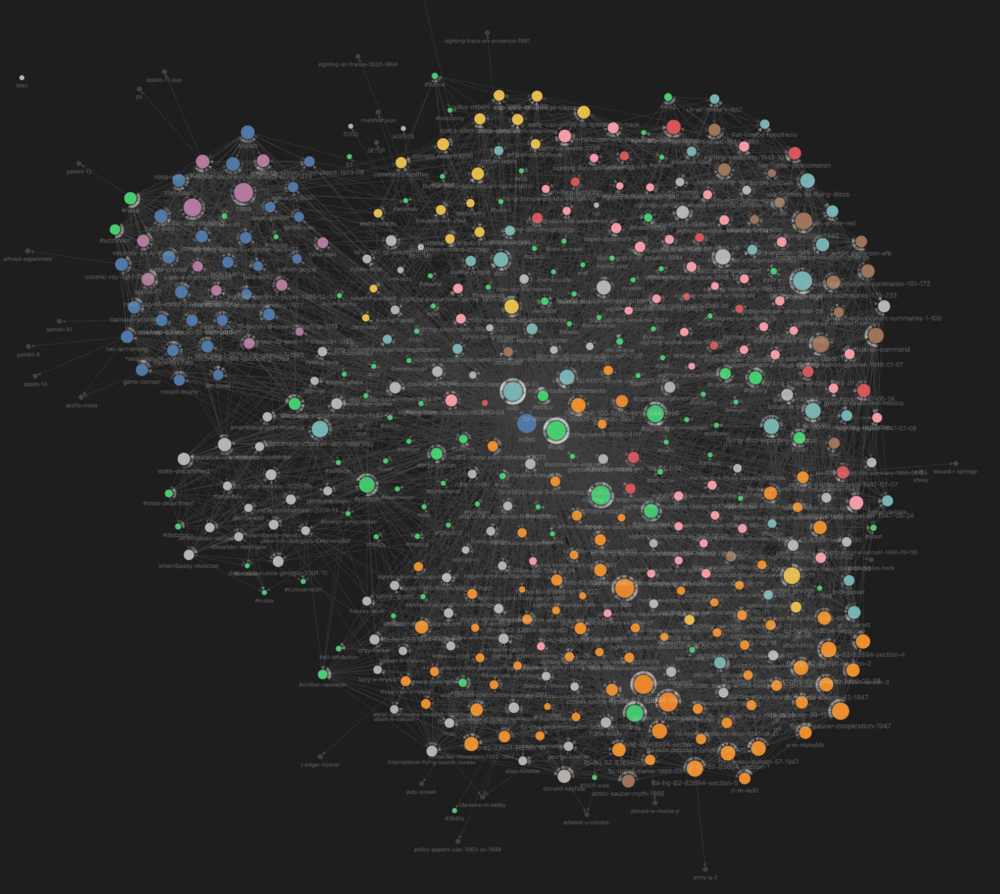

# war.gov/UFO Knowledge Graph Wiki

👉 Live Wiki: https://publish.obsidian.md/pax-uap/README

An AI agents-ready Obisdian knowledge graph wiki compiled from the OCRd war.gov/UFO files — FBI files, State Department cables, NASA crew debriefings, USAF intelligence directives, Project SIGN incident summaries, and US Navy mission reports — woven together as interconnected Obsidian markdown.



The goal: turn a heap of ~110 FOIA-released JSON-OCR'd documents into a navigable, queryable, citation-grounded knowledge base where every claim links back to a primary source.

## Status

| Metric | Value |
|---|---|
| Sources ingested | **50 / 110** |
| Vault pages | **310** |
| Date range covered | **6 Jul 1947 → 12 Mar 2026** |
| Last ingest | 2026-05-11 |

See [TODO.md](TODO.md) for orchestration plan, batch cadence, and remaining sources.

## Vault structure

```text
.manifest.json          # Single source of truth — every ingested file with content hash
index.md                # Master index of every page
log.md                  # Chronological activity log (every ingest, lint, cross-link)
hot.md                  # ~500-word session hot cache — recent activity + active threads
_meta/taxonomy.md       # Controlled tag vocabulary
sources/                # Raw OCR'd JSON documents waiting to be ingested
concepts/   (46 pages)  # Abstract ideas, patterns, mental models
entities/   (109 pages) # People, agencies, units, missions, files, organizations
references/ (153 pages) # Source documents + individual sighting cases
synthesis/  (5 pages)   # Cross-cutting analyses connecting multiple concepts
projects/uap/           # Project hub page
```

Every page has frontmatter: `title`, `category`, `tags` (≤5 canonical), `sources`, `created`, `updated`, `summary` (≤200 chars), `provenance`, `base_confidence`, `lifecycle`. Pages link via `[[wikilinks]]` to form a graph.

## Major corpus anchors

**FBI HQ 62-HQ-83894** — COMPLETE 17/17 artifacts (6 Jul 1947 → 14 Jun 1977, ~30 years, 2,159 OCR pages). The richest single-file structural-history artifact in the wiki. 14 distinct intake channels mapped: civilian correspondence, AAF cooperation regime (Bureau Bulletin No. 42 + 57), inter-agency directives, press clippings, FBI field investigations, policy bulletins, post-Blue-Book Carter-era coordination. Start at [entities/fbi-hq-62-83894-file.md](entities/fbi-hq-62-83894-file.md).

**Project SIGN** — 233 incident summaries across 3 NARA box7 bundles (8 Jul 1947 Muroc → 1 Jan 1949 Jackson MS). Founding cases anchored as standalone sighting pages: Arnold Mt Rainier, Mantell Godman, Rhodes Phoenix, Chiles-Whitted, Gorman Fargo, Cascade Mts Johnson. See [concepts/project-sign.md](concepts/project-sign.md).

**NASA orbital UAP** — Complete d-cluster (Gemini 7 + Apollo 11/12/17 + Skylab), 7/7 files, 6-mechanism A/B/C/D/E/F orbital UAP typology. Apollo 11 "second look" cylinder (multi-witness, instrument-mediated, alternative-eliminated) is the strongest astronaut-class anchor. See [concepts/orbital-uap-sighting.md](concepts/orbital-uap-sighting.md).

**State Department UAP cables** — 5 cables: PNG 1985 (substantive), Kazakhstan 1994 (substantive), Turkmenistan 2004 (boundary-NGO), Russia/Georgia 2001 (figurative rhetoric), Mexico 2023 (Maussan/Graves Congress). Three sub-patterns under one diplomatic-channel umbrella. See [concepts/diplomatic-channel-uap-reporting.md](concepts/diplomatic-channel-uap-reporting.md).

**Policy / institutional structure** — Cabell AIRMEM #4 (1949), AFOIC-CC-1 (1950), FSR 200-4 reporting regulation, Bureau Bulletin No. 42/57, SAC Letters #38/83, Boggs-Hearn FBI+AF discontinuation memo (1950), Project Twinkle (1950), Project GRUDGE termination, Robertson Panel runup (1952), CIA-IAC Russell-sighting suppression (1955), Condon Committee, Project BLUE BOOK termination (1969), Carter-era post-Blue-Book coordination (1977). All primary-source anchored.

**1947 founding period** — Schulgen-Reynolds-Ladd-Hoover negotiation arc, Bureau Bulletin No. 42 birth (30 Jul 1947), BB-57 birth chain (Sep 1947), AFBIR-CO 18-sighting analysis (predates Twining by 8 weeks), Roswell hex-disc URGENT teletype, Maury Island full Seattle report + Crisman/Dahl admission, Garrett admission (Sep 1947) on "high brass unconcern = they know what these are."

**Other paradigm cases**: Lonnie Zamora Socorro NM 1964 (FBI field investigation by SA Byrnes), García Macías Durango Mexico 1950 (earliest FBI-corpus UAP record), 1944 foo-fighters (SHAEF intelligence), USAFE TT 1524 (1948 Swedish-AIS ETI attribution chain), Hunter 1963 NASC "Space Alien Race" memo, COMETA Report 1999, AAFFS-Graves-Maussan 2023 Mexican Congress, 2025 helicopter-orb encounter, 2026 western US event slides.

## How to use

If you're reading this wiki:

- **Browse**: open in [Obsidian](https://obsidian.md) for the graph view and live wikilinks. Start at [index.md](index.md) or one of the major hub pages listed above.
- **Query via the framework**: from any agent that supports the obsidian-wiki skills, say *"what do I know about \<topic\>"* — the [wiki-query](https://github.com/Ar9av/obsidian-wiki) skill scans titles, summaries, and tags first, then opens page bodies as needed, and returns wikilink-cited answers.
- **Sources are tracked**: every page lists its source documents in frontmatter under `sources:`. The hash of each ingested document is in [.manifest.json](.manifest.json) for idempotency. Run `wiki-ingest` again on the same file and it skips by SHA-256.

If you're contributing to this wiki:

- Drop new OCR'd JSON documents in `sources/` and invoke `/obsidian-wiki-ingest`.
- For a single source: pass the path in the prompt. The skill computes the hash, runs the 7-step pipeline (read → QMD discovery → extract → plan → write → cross-ref → manifest), and atomically updates state files.
- Every ~10 sources, run `/cross-linker` + `/wiki-lint` + `/tag-taxonomy` for graph hygiene.

## Framework

Built on the [obsidian-wiki](https://github.com/Ar9av/obsidian-wiki) framework — a skill-based system where everything is markdown instructions any AI coding agent can read. No scripts or dependencies. Each `.skills/<name>/SKILL.md` is a self-contained procedure. See [SETUP.md](SETUP.md) for installation, [AGENTS.md](AGENTS.md) for agent context, and the upstream [framework README on GitHub](https://github.com/Ar9av/obsidian-wiki).

## License

Wiki content compiled from US Government declassified materials (public domain) and a small number of openly-published reports (COMETA, civilian-research clippings — fair-use citation). All primary-source attribution preserved per-page in `sources:` frontmatter and provenance blocks.
